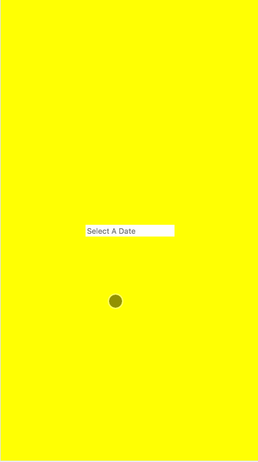
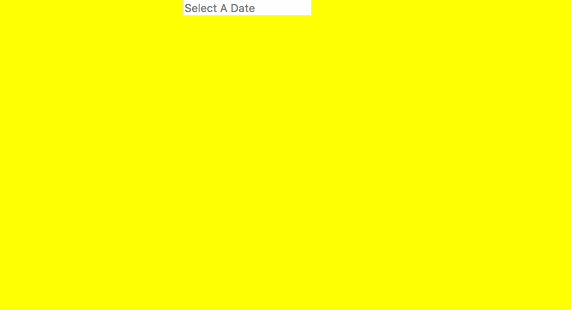

UglyDate
===================
A JavaScript date range selector for everyone.


UglyDate handles date ranges well and that's all. As a purpose specific component it will solve this one problem perfectly, without the bloat of extra code for unneeded features. UglyDate is inspired by the date selector on [Google Flights](http://google.com/travel). 






### Features

- Select a start and end date. Those can be the same day or different days.
- On desktop provide a window to allow for two months to be viewed at the same time. This is a great pattern for things like hotel reservations, trips, and so on.
- Mobile First. This component is designed with smaller devices in mind. On mobile we switch to an overlay mode that allows a user to choose a date without the need for hover states. On desktop mode UglyDate shows multiple months with a next/prev navigation.
- Broadcast regular Input `change` events so the component can be tied into regular forms or other JS changes without additional configuration.

### Getting Started

UglyDate is available via `yarn` and `npm`.

```
npm install uglydate
```

You can also download the [minified file](./dist/uglydate.min.js) found in this repository.

#### Basic Usage

```
<div data-uglydate data-uglydate-large-screen-width="640">
	<input type="date" placeholder="Select A Date" min="2020-01-01" max="2020-01-01" data-uglydate-start-date />
	<input type="date" placeholder="Select A Date" min="2020-01-01" max="2020-01-01" min="2017-12-08" max="2018-12-06" data-uglydate-end-date />
</div>
```

1. Add the `data-uglydate` attribute to an HTML node. Somewhere in that node's subtree must contain two `input` elements set to a type of `date`.
2. Provide a `data-uglydate-large-screen-width` parameter, which tells UglyDate when to switch to desktop mode.
3. Give the input elements `data-uglydate-start-date` and `data-uglydate-end-date` attributes respectively.
4. Embed the library.
6. When you're ready (at the bottom of the page, e.g.), write the following:

```
<script type="text/javascript">
	var ud = new UglyDate()
</script>
```

More specific examples can be found in the [examples directory](./examples/).


The Ugly Philosophy
------------------
- Ship with an example CSS file, unminified. That theme is deliberately terrible - putrid colors and Comic Sans MS. The idea is that your design team is forced to focus on the theme, and thus improve the design quality of the site.

- Build vanilla and focus on a single, simple problem. There are few options or additional parameters provided with this component, so that it solves just one thing right.

- Place an emphasis on [Progressive Enhancement](https://en.wikipedia.org/wiki/Progressive_enhancement). The component begins with raw, rendered HTML on the page and adjusts with JavaScript.

- Expose the `prototypes` directory for those just starting out or curious. We don't just want to build the component in the open, we want to show how we figured out what works.